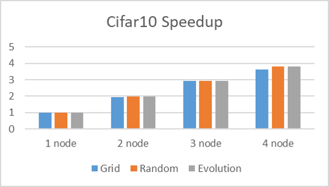
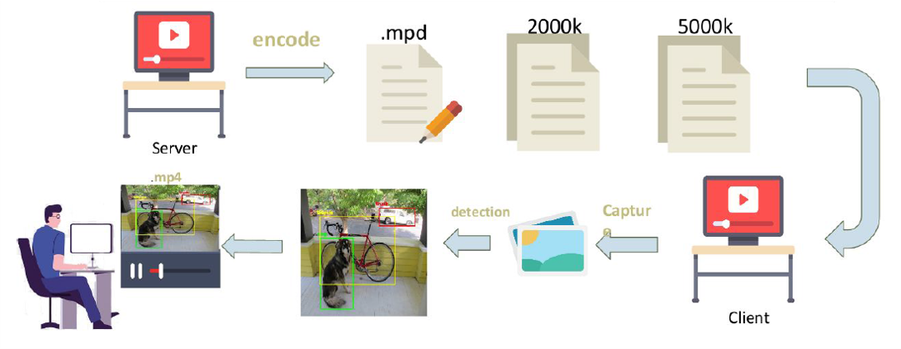

# Projects  

## [Multi-Style Semantic Style Transfer](projects/MultiStyleNST.md)

  <table>
    <tr>
      <th
        class = "imageColumn">
        
      </th>
      <th
        class = "textColumn">
            This project is aimed to transfer different semantic objects in one image into different styles. We use pretrained semantic segmentation model (DeepLab-V3) to get the foreground and background region, and apply style transfer on different style for each region. In addition to style loss and content loss in traditional neural style transfer, we further add style-blending loss and total variance loss to make the result more harmony when blending very different style. Also, we provide custom control of blending effect. 
      </th>
    </tr>
  </table>

## [Distributed Hyper-Parameters Optimization](projects/DHPO.md)

  <table>
    <tr>
      <th
        class = "imageColumn">
        
      </th>
      <th
        class = "textColumn">
            Hyper-parameters optimization problem is aimed to find the most suitable hyper-parameters for training neural network. This project use Grid Search, Random Search and Evolutionary Search to tackle hyper-parameters optimization problem, and use CUDA-Awared MPI (Distributed Computing) to accelerate the process. We achieve 3.65 to 3.8 speedup under 4 nodes.
      </th>
    </tr>
  </table>

## [Object-Detection In Streaming](projects/Detection-Streaming.md)

  <table>
    <tr>
      <th
        class = "imageColumn">
        
      </th>
      <th
        class = "textColumn">
            In this project, we use XAMPP to build the server, and using MPEG-DASH as Streaming protocol to do live streaming. To be able to select which objects to detect by user, we use the Single Shot Multi-box Detector (SSD) to do objection detection in client side.
      </th>
    </tr>
  </table>

## [Quickdraw, Doodle Recognition Challenge](projects/Quickdraw.md)

  <table>
    <tr>
      <th
        class = "imageColumn">
        
      </th>
      <th
        class = "textColumn">
            Attending Kaggle Competition Quickdraw-doodle Recognition Challenge. I adopt the ResNeXt as the model architecture to do the recognition, and used some techniques such as model ensemble to improve the performance. The result map@3 score (from 340 categories) is 92.46%, which is top 18% among 1,316 teams.
      </th>
    </tr>
  </table>

## [Android Text-Detector](projects/Android-TextDetector.md)

  <table>
    <tr>
      <th
        class = "imageColumn">
        
      </th>
      <th
        class = "textColumn">
            Deploy SoTA text detection model (CRAFT) on mobile devices. The major work of this project includes develop android app with the OpenCV SDK, export serializable PyTorch models and convert codes from Python to Java.  
      </th>
    </tr>
  </table>

## [Knuckles-Recognition as a novel input method for smart glasses](https://github.com/aa10402tw/Knuckles-Recognition)

  <table>
    <tr>
      <th
        class = "imageColumn">
        
      </th>
      <th
        class = "textColumn">
            Developed a model to classify which knuckle is closest to the camera of smart glasses, which enables users to use different knuckles as different input function for a novel smart glasses prototype. 
      </th>
    </tr>
  </table>

## [Video Gesture Recognition](projects/Video-Gesture.md)

  <table>
    <tr>
      <th
        class = "imageColumn">
        
      </th>
      <th
        class = "textColumn">
            This project is aimed to do the gesture recognition task using CNN-RNN architecture, and train the model on the 20BN-JESTER dataset. I use the CNN + LSTM model to classify 27 different predefined gestures in webcam video. The resulting accuracy is about 82% at validation set, and the model can also accurately classify gesture in real world scenario.
      </th>
    </tr>
  </table>

