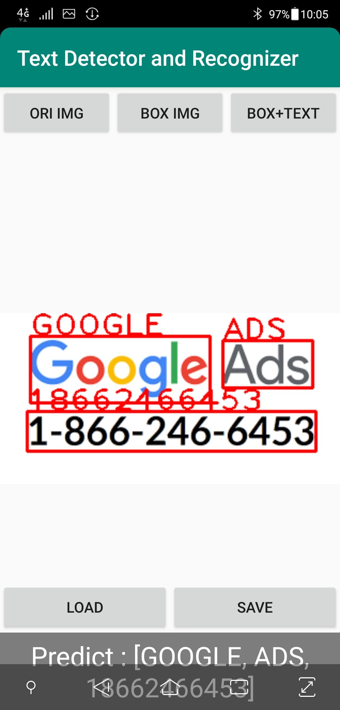

	<h1 style="display:inline;"> Android Text-Detector  </h1> 
	<a href="https://github.com/aa10402tw/Android_Text-Detector"> [Code] </a> 

Deploy SoTA text detection model (CRAFT) on mobile devices. The major work of this project includes develop android app with the OpenCV SDK, export serializable PyTorch models and convert codes from Python to Java.

## Implementation
I adopt the text detection model ([CRAFT](https://github.com/clovaai/CRAFT-pytorch)), and export [PyTorch serializable model](https://pytorch.org/docs/stable/notes/serialization.html) to make the model can run on the mobile. In additon, to make the input and output of model in correct format I rewrite the Python source code about pre-processing and post-processing into Java code. I also develop the this app with OpenCV SDK to have basic functionaliy, including load arbitrary image from phone storage, draw the bounding box and corresponding text on the image, and save the result image to phone storage.  

