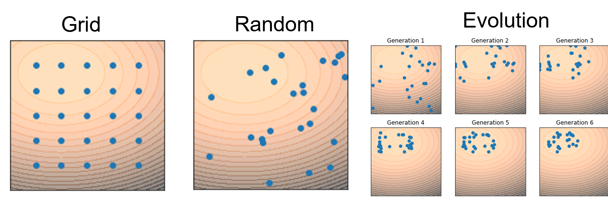
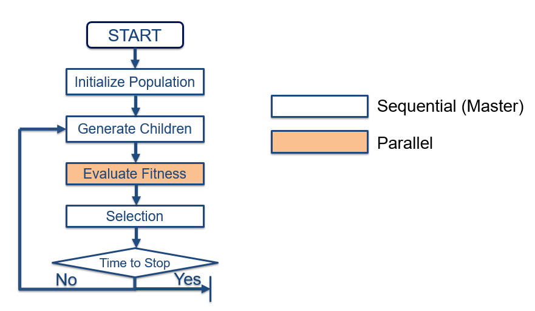
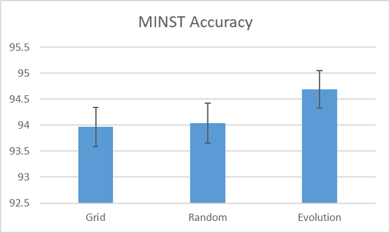
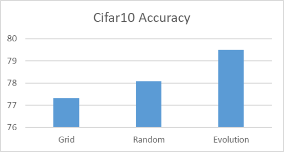
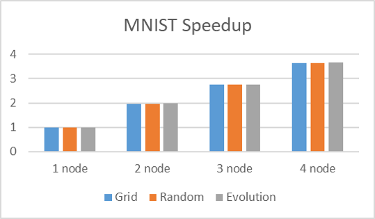

	<h1 style="display:inline;"> Distributed Hyper-Parameters Optimization </h1> 
	<a href="https://github.com/aa10402tw/Distributed-Hyper-Parameters-Optimization"> [Code] </a> 

Hyper-parameters optimization problem is aimed to find the most suitable hyper-parameters for training neural network. This project use Grid Search, Random Search and Evoluationary Search to tackle hyper-parameters optimization problem, and use CUDA-Awared MPI (Distributed Computing) to accerlate the process. We achieve 3.65 to 3.8 speedup under 4 nodes.

## Hyper-parameters optimization 

Hyper-parameter optimization refers to the problem of choosing the optimal hyper-parameters for a learning algorithm automatically. The Main approaches until today include Grid Search,
Random Search, and Evolutionary Optimization. In the Grid Search process, we just have to evaluate the set of hyper-parameter we just generated and find the best one. Random Search replaces the exhaustive enumeration of all combinations by selecting them randomly. This can be simply applied to the discrete setting described above, but also generalizes to continuous hyper-parameter spaces.
Evolutionary hyper-parameter optimization follows a process inspired by the biological concept of evolution, which is basically to generate new sample points based on the old ones with good performance. 

## How to parallelize
  
Because the Grid Search and Random Search approach are easily to parallelize, our project focused on the parallelization of Evolutionary Optimization approach. In our project, we will focus on paralleling hyper-parameter evaluation since it takes most time in the process of searching best
hyper-parameter and the others in the process will keep serial. Each time when we have to do the process of evaluating hyperparameter, the tasks of evaluating hyper-parameter will be distributed to different hosts evenly. After the hosts gain the result of hyper-parameter, we will collect them and determine whether the stop criteria is reached. If we reached the stop criteria, we can stop
all the jobs in different hosts and record the best hyper-parameter.

## Result 
### Accuracy Comparison
   
For MNIST dataset, as the result shown in figure, the performance of evolutionbased method (94.67%) is better than grid and random search (93.97% and 94.03%, respectively).
For CIFAR-10 dataset, as the result shown in figure, the performance of evolutionbased method (79.51%) is also better than grid and random search (77.32% and 78.08%, respectively).

### Speedup
 
The speedup evolution-based method on MNIST and CIFAR-10 on 4 nodes are 3.65 and 3.80, respectively. 
In this experiment, we measure the execution time of each method on different number of nodes, and all of grid, random as well as evolution-based method achieve good speedup.