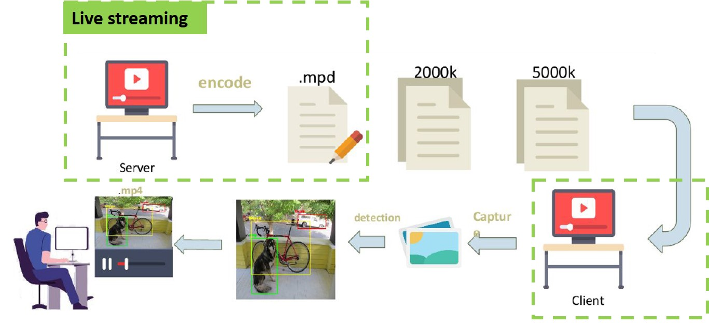
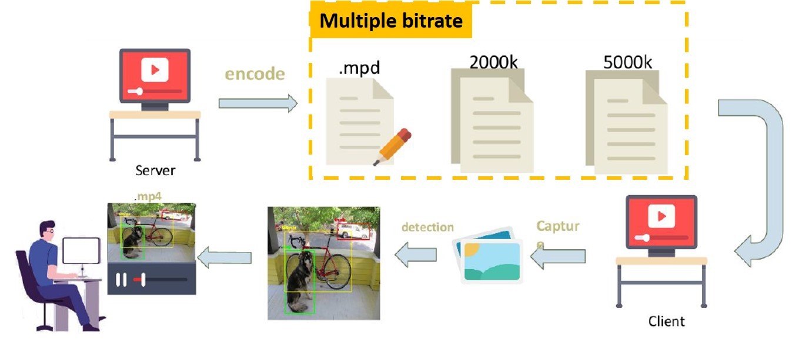
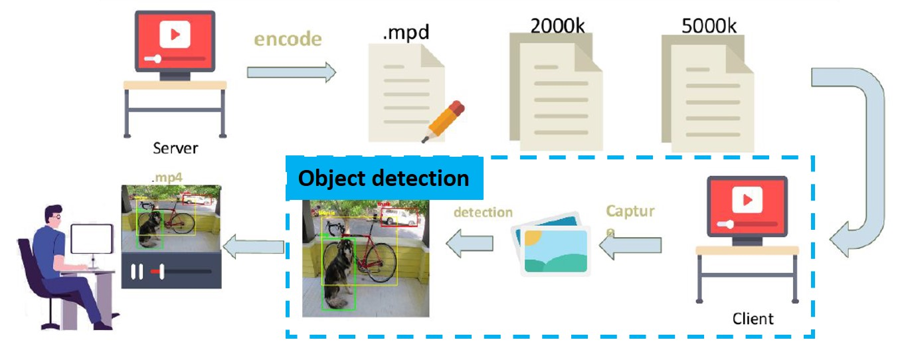
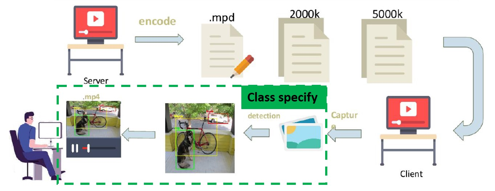
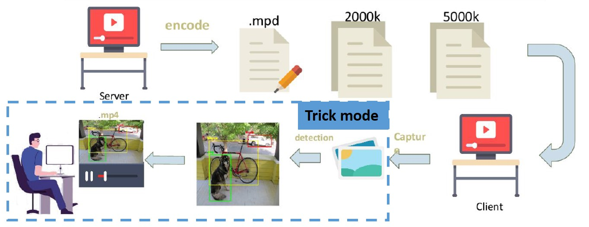

	<h1 style="display:inline;">Object-Detection In Streaming </h1> 
	<a href="https://github.com/aa10402tw/Object-Detection-In-Streaming"> [Code] </a> 

In this project, we use XAMPP to bulid the server, and using MPEG-DASH as Streaming protocol to do live streaming. To be able to select which obejcts to detect by user, we use the Single Shot Multibox Detector (SSD) to do objection detection in client side.

## Live Streaming 

- Server: XAMPP
- Streaming protocol: MPEG-DASH
- Manifest file: .mpd 
- Video to streaming: ffmpeg

## Multiple bitrate
  

we use three different bit rate (.mpd file), represent three different resolution. 
- Low resolution – 320*180 (500k)
- Middle resolution – 640*360 (750k)
- High resolution – 1280*720 (1500k)

## Object Detection
  

- Use Chrome driver to extract information of html
- Feed frame of video to network every 0.05 second
- Use SSD network which trained on VOC dataset
- Draw the resulting bounding box on the canvas

## Select class to track
  

- Only draw the bounding box of classes selected by user

## Trick Mode
  

- Design buffer to store the video (30 seconds)
- User can forward or rewind the video.
