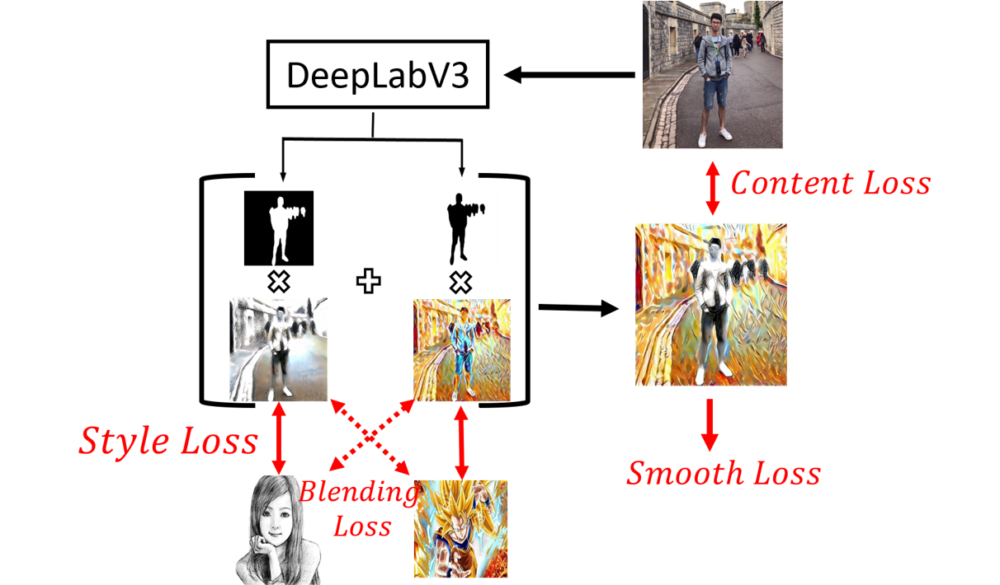
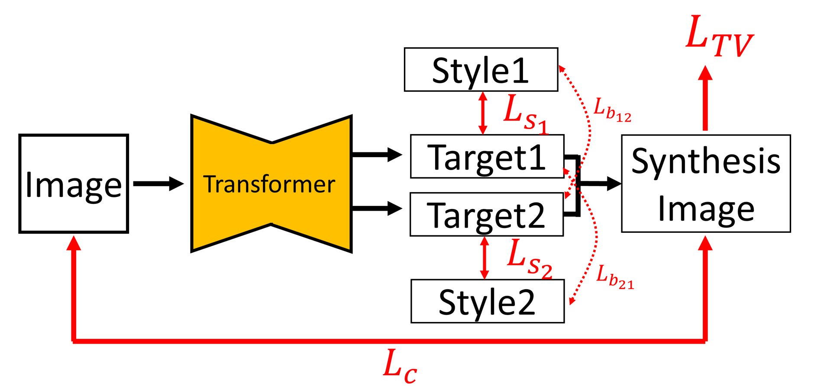

	<h1 style="display:inline;"> Multi-Style Semantic Style Transfer </h1> 
	<a href="https://github.com/aa10402tw/MultiStyle-Semantic-Style-Transfer"> [Code] </a> 

This project is aimed to transfer different semantic objects in one image into different styles. We use pretrained semantic segmentation model (DeepLab-V3) to get the foregound and backgound region, and apply style transfer on different style for each region. In addition to style loss and content loss in traditional neural style transfer, we futher add style-blending loss and total variance loss to make the result more harmony when blending very different style. Also, we provide custom control of blending effect. 

## Model Architecture

Given one image Isrc and two target style images Is1 and Is2, we want to transfer different semantic objects into different style accordingly. We first produced two intermediated result image Ii1 and Ii2, and compute the style loss between (Is1, Ii1) and (Is2, Ii2). The we merge these two intermediated images into final result image Iresult by semantic map predicted by DeepLab-V3 image. Finally compute the content loss between (Isrc, Iresult). Further more, to make the resulting image more harmony while blending different styles and prevent weird boundary after merging two intermediated images, we also compute the style-blending loss which is weighted style loss between (Is1, Ii2) and (Is2, Ii1), and smooth loss which is total variance of Iresult. The entire loss function can be written as follow: 
L = &lambda;1Lstyle + &lambda;2Lblend + &lambda;3Lcontent + &lambda;4LSmooth
&nbsp;

## Result 
### Compare with naive approach

To validate the effectiveness of additional loss function, we compare the result from removing both blending and smooth loss (left figure), the result from removing smooth loss (mid figure) and the result from using all loss function mentioned above (right figure). From the result we can observe that the naive method will result in weird boundary between different semantic objects. After adding the blending loss, this artifact would improve a lot, and the result of boundary is most clean if all loss function is applied. However, after adding the smooth loss, the resulting image will lose some detail of style (e.g., little spot and stripe). We consider it is a tradeoff between less artifact at boundary and more detail in style, and the effect can be control through adjust the weight of smooth loss.

### Style Blending Ratio

Furthermore, we observe that using naive method sometimes cause the resulting image to become very disharmonious if the two target styles is very different (the first figure). After adding the style blending loss, the resulting will become much harmonious (the last figure). However, when the weight of blending loss become too large, it become hard to distinguish different style in different semantic object. So again, we consider it is a tradeoff between making the resulting image more distinguishable to different style and more harmonious.

### Sample Result
 

### Video Style Transfer
 
Traditional neural style transfer use **On-line Image Optimization** approach, but it could take long time if we want to transfer many image (In our environment, optimize an image take a few minutes). To transfer a video that contain hundreds of even thousands of frames, we first use **Off-line Model optimization** approach to train a transfer model, the for each frame in the video, we can feed it into model and get the resulting image in a few second, whcih make transfer style of video become more practicable.  
   

