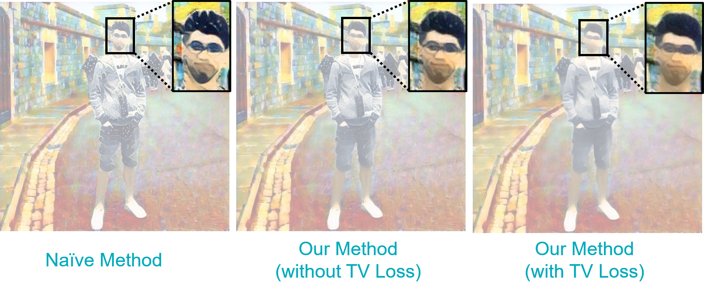
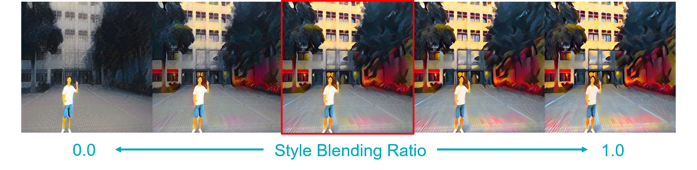

	<h1 style="display:inline;"> Multi-Style Sematic Style Transfer </h1> 
	<a href="https://github.com/aa10402tw/MultiStyle-Semantic-Style-Transfer"> [Code] </a> 

This project is aimed to transfer different semantic objects in one image into different styles. We use pretrained semantic segmentation model (DeepLab-V3) to get the foregound and backgound region, and apply style transfer on different style for each region. In addition to style loss and content loss in traditional neural style transfer, we futher add style-blending loss and total variance loss to make the result more harmony when blending very different style. Also, we provide custom control of blending effect. 

## Model Architecture

Given one image Isrc and two target style images Is1 and Is2, we want to transfer different semantic objects into different style accrodingly. We first produced two intermediated result image Ii1 and Ii2, and compute the style loss between (Is1, Ii1) and (Is2, Ii2). The we merge these two intermediated images into final result image Iresult by semantic map predicted by DeepLab-V3 image. Finally compute the content loss between (Isrc, Iresult). Further more, to make the resulting image more harmony while blending different styles and prevent weird boundary after merging two intermediated images, we also compute the style-blending loss which is weighted style loss between (Is1, Ii2) and (Is2, Iii), and smooth loss which is total variance of Iresult. The entire loss function can be written as follow: 
L = &lambda;1Lstyle + &lambda;2Lblend + &lambda;3Lcontent + &lambda;4LSmooth
&nbsp;

## Result 
### Compare with naive approach

### Style Blending Ratio

### Sample Result
 

### Video Style Transfer
 

