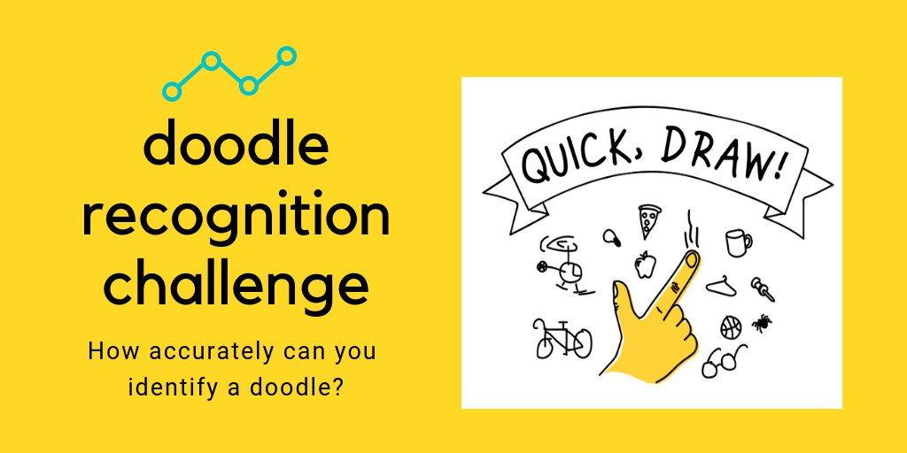
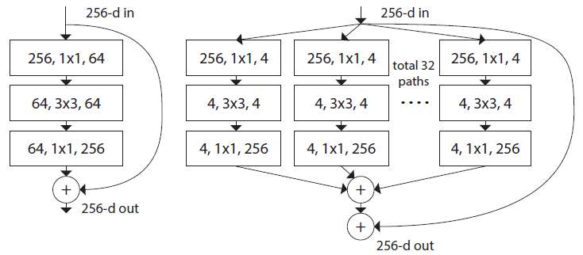

	<h1 style="display:inline;"> Quickdraw, Doodle Recognition Challenge </h1> 
	<a href="https://github.com/aa10402tw/Quickdraw-Doodle-Recognition"> [Code] </a> 

Attending Kaggle Competition Quickdraw-doodle Recognition Challenge. I adopt the ResNeXt as the model architecture to do the recognition, and used some techniques such as model ensemble to improve the performance. The result map@3 score (from 340 categories) is 92.46%, which is top 18% among 1,316 teams.

## Model Architecture

Because there are 50M drawings encompassing 340 label categories in the dataset, I want to use efficient model architecture. Therefore, I use the state of the art architecture ResNext (at that time).

## Result 
I train a few models that are trained with different hyper-parameter, then use model ensemble technique. The resulting map@3 score is 0.92, which is which is top 18% among 1,316 teams.

