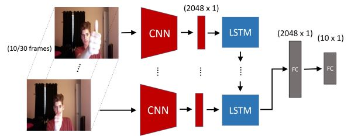
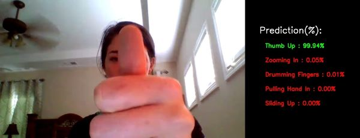
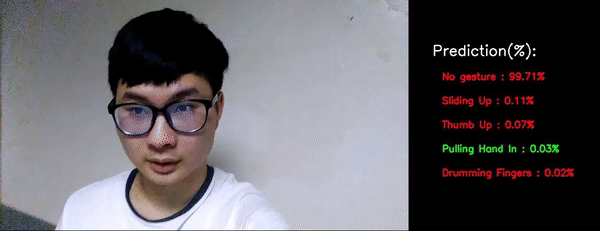

	<h1 style="display:inline;"> Video Gesture Recognition </h1> 
	<a href="https://github.com/aa10402tw/Gesture-Recognition"> [Code] </a> 

This project is aimed to do the gesture recognition task using CNN-RNN architecture, and train the model on the 20BN-JESTER dataset. I use the CNN + LSTM model to classify 27 different predefined gestures in webcam video. The resulting accuracy is about 82% at validation set, and the model can also accurately classify gesture in real world scenario.

## Result
Sample result from dataset

Sample result from realworld

